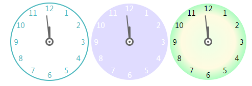

<h1 align="center">vue clock2</h1>

<p align="center">
  <a href="https://npmjs.org/package/vue-clock2">
    
  </a>
  <a href="https://npmjs.org/package/vue-clock2">
    
  </a>
  <a>
    
  </a>
</p>

> Analogue Clock Component for Vue.js


## Install

```console
npm install vue-clock2
```

or

```console
yarn add vue-clock2
```


## Example for Vue.js 2

[Demo](https://bestvist.github.io/vue-clock2/docs/)

```html
<template>
  <clock :time="time"></clock>
</template>

<script>
  import Clock from 'vue-clock2';
  export default {
    components: { Clock },
    data () {
      return {
          time: '10:40:00'
      }
    }
  }
</script>
```


## Example for Nuxt.js 2.10+

```js
// Add this to ~/plugins/clock.js

import Clock from 'vue-clock2';
import Vue from 'vue';

Vue.component('clock', Clock);
```

```js
// Add clock.js to your nuxt.config.js
plugins: [
  { src: '~plugins/clock', mode: 'client' }
],
```

```html
<!--
Wrap any <clock> components like so:
-->

<template>
  <client-only>
    <clock :time="time"></clock>
  </client-only>
</template>
```


## Default Style


## Some Sample Styles




## Props

| Property | Description | Type | Accepted Values | Default |
|-|-|-|-|-|
| time | time to display | String | - | - |
| color | color to display | String | - | - |
| border | clock border style | String | - | '2px solid' |
| bg | clock background style | String | - | - |
| size | size to display | String | - | 150px |


## License

[MIT](https://github.com/bestvist/vue-clock2/blob/master/LICENSE) 
