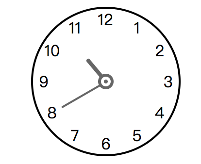

<h1 align="center">vue clock</h1>

<p align="center">
  <a href="https://npmjs.org/package/vue-clock2">
    
  </a>
  <a href="https://npmjs.org/package/vue-clock2">
    
  </a>
  <a>
    
  </a>
</p>

> vue clock component

## Install

```
npm install vue-clock2
```

## Example

```
<template>
  <clock :time="time"></clock>
</template>

<script>
  import Clock from 'vue-clock2';
  export default {
    components: { Clock },
    data () {
      return {
          time: '10:40'
      }
    }
  }
</script>
```



## Props

| Property | Description | Type | Accepted Values | Default |
|-|-|-|-|-|
| time | time to display | String | - | - |
| color | color to display | String | - | - |
| size | size to display | String | small | - |